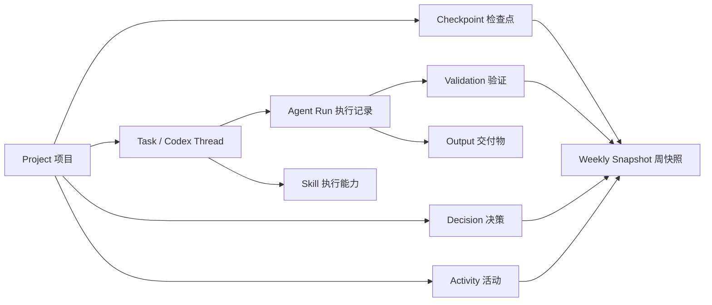
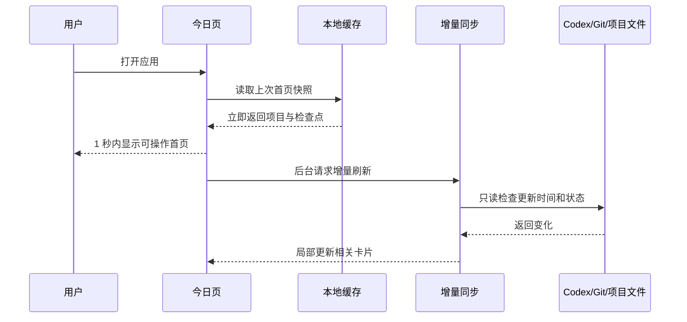
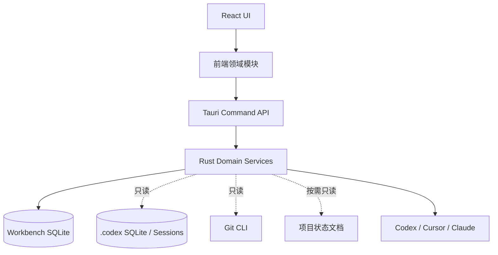

# 个人 AI 工作台 MVP：产品需求与技术架构

> 文档状态：待确认  
> 版本：1.0 Draft  
> 日期：2026-09-22  
> 目标项目：`E:\Projects\agent-skill-workbench`  
> 产品形态：Windows 本地优先桌面应用  
> 技术基线：Tauri 2 + React + TypeScript + Rust + SQLite

---

## 1. 执行摘要

### 1.1 产品定位

个人 AI 工作台不是新的聊天客户端，也不是复杂的项目管理系统。它是一个每天打开的本地工作入口，负责把分散在 Codex 对话、本地项目、Git 状态、进度文档和 Skill 中的信息压缩成三个答案：

1. 今天应该继续什么？
2. 当前项目真实处于什么状态？
3. 这一周实际完成了什么？

一句话定位：

> 自动恢复项目上下文、复用本机 Skill、减少重复操作，并持续形成可信周看板的个人工作台。

### 1.2 MVP 核心闭环

```text
打开工作台
→ 立即看到最近项目和下一步
→ 点击“继续工作”
→ 系统只读核对 Codex、Git 和项目状态
→ 生成恢复卡片
→ 打开原任务或生成精简续接上下文
→ 记录本次活动和验证结果
→ 自动汇入本周看板
```

### 1.3 MVP 一级结构

MVP 只保留三个日常页面和一个现有工具入口：

```text
今日
项目
周看板

工具
└── Skills
```

全局搜索通过 `Ctrl + K` 唤起；设置放在右上角，不占据日常主导航。

### 1.4 核心设计结论

- 项目是上下文容器，但首页以“下一步行动”为中心。
- Conversation 是证据来源，不是工作台的主要组织方式。
- Skill 是执行能力，不要求用户每次先寻找 Skill 再工作。
- 工作流是用户可理解的动作，例如“继续工作”“检查改动”“生成提交说明”。
- 周看板只展示交付、阻塞、验证、决策和下一步，不用消息数或 Token 数评价生产力。
- 所有自动结论必须可追溯、可修正，且不能覆盖项目事实来源。

---

## 2. 需求依据与现状审计

### 2.1 历史行为依据

本次设计基于本地 `.codex` 中 2026-07-31 至 2026-09-22 的历史记录：

- 212 个用户主任务。
- 62 个子 Agent 任务。
- 高频行为包括：恢复项目进度、更新进度文档、检查代码改动、生成 Git message、排查 Bug、验证构建、整理 3D 资产、安装与优化 Skill、多 Agent 编排。
- 个人工作台需求经历了“Skill 收藏 → Skill 工作台 → 多项目控制台 → 项目与证据驱动工作台”的演进。

ChatGPT 侧的二次分析进一步补充了 Research、方案设计、Prompt、AI 成本和 3D Asset Lab 等场景，但这些能力不直接映射为一级导航，而应作为工作流或项目专用视图。

### 2.2 现有项目能力

现有 `agent-skill-workbench` 已具备以下后端或页面能力，应复用而不是重写：

- 扫描 Codex、Claude、Cursor、Gemini 和 Agents 的 `SKILL.md`。
- Skill 自动分组、变体、关系、详情和使用卡片。
- 外部 Skill 更新命令与实时输出。
- Skill 复制到其他 Agent。
- 调起 Cursor/Codex 优化 Skill。
- 解析本地 Agent 历史并生成 Skill 调用事件。
- 项目、工作区、任务、来源、知识条目和 Agent Run 数据结构。
- Agent 启动、Prompt 快照、结果摘要、改动文件和验证记录。
- 本地 SQLite 数据库。
- Tauri Windows 安装包与可执行程序。

### 2.3 当前主要问题

#### 产品问题

- 文档在“通用 Work OS”和“Skill 专用工作台”之间多次摇摆，缺少稳定的最小日常闭环。
- 当前可见导航收敛为 Skill、调用历史和设置，但无法回答“今天继续什么”和“本周完成什么”。
- 已有项目、任务、来源和 Agent Run 能力被隐藏，资产价值没有转化为日常体验。
- 原始功能较多，但缺少一个低认知成本的主入口。

#### 体验问题

- 用户仍需手工寻找旧对话、读取进度文件和判断下一步。
- Skill 管理与真实项目工作脱节，需要先找到 Skill，再返回项目重复输入上下文。
- 周度成果依赖手工回忆，缺少可靠的自动草稿。
- 自动化能力如果直接暴露为大量模块，会让用户先判断“该用哪个工具”，增加操作成本。

#### 技术与性能问题

- `src/main.tsx` 当前约 5095 行、168 KB，承担大量页面、类型、数据加载和交互职责。
- 当前生产 JavaScript 主包约 587 KB，并已有 chunk 体积警告。
- 多个历史功能仍打包在首屏，即使当前导航不可见。
- 大型本地历史文件不适合在每次启动时重新解析。
- 工作区基线扫描可能遍历大量文件，不适合作为首页启动阻塞任务。

---

## 3. 产品目标、非目标与成功标准

### 3.1 MVP 目标

#### G1：降低上下文恢复成本

用户从打开应用到知道“下一步做什么”不超过 30 秒。

#### G2：减少重复操作

将高频动作固化为一键工作流，减少重复寻找对话、复制 Prompt、重新描述项目和手工汇总状态。

#### G3：形成可信周看板

自动生成本周交付、进行中事项、阻塞、验证和下周重点草稿，用户只需校正。

#### G4：复用现有 Skill 管理

保留现有 Skill 管理的完整能力，同时让 Skill 能够在首页和项目工作流中被自动推荐与复用。

#### G5：保证每日打开体验

首页不依赖 AI 调用、不等待全量同步、不扫描全部磁盘；优先用缓存立即渲染，再后台增量刷新。

### 3.2 非目标

MVP 不做：

- 新的 ChatGPT/Codex 聊天客户端。
- Jira、Linear、Notion 或 Obsidian 的完整替代品。
- 复杂甘特图、Sprint、团队权限和多人协作。
- 无人值守自动修改代码。
- 通用多 Agent 编排平台。
- 完整 Prompt Studio。
- AI 订阅和成本财务系统。
- 全磁盘文件管理器。
- 云同步和账号系统。
- 消息数、Token 数或工作时长生产力评分。
- 启动时自动调用大模型生成内容。

### 3.3 成功标准

MVP 上线后连续使用两周，满足以下标准：

1. 80% 的工作日从“今日”页进入实际项目。
2. 70% 的继续操作无需重新阅读完整历史对话。
3. 周看板草稿中至少 70% 的完成项和阻塞项可直接保留。
4. 高频工作流平均减少至少 3 个手工步骤。
5. Skill 管理现有能力无回归。
6. 冷启动在目标设备上 1.5 秒内可交互。
7. 首页不因任何单一数据源不可用而整体阻塞。

---

## 4. 用户模型与核心任务

### 4.1 目标用户

单用户、本机使用，同时推进多个开发、设计、研究或 3D 项目，经常在 Codex、Cursor、Claude、浏览器、Git 和本地文件之间切换。

### 4.2 核心 Job To Be Done

#### JTBD-01：恢复工作

当我重新回到一个项目时，我希望立即知道上次完成了什么、现在是否发生变化、下一步是什么，从而不用重新翻阅对话和文档。

#### JTBD-02：调用能力

当我要执行高频任务时，我希望直接选择“检查改动”或“验证修改”，由系统自动带入项目和 Skill，而不是自己查找 Skill 和重新输入上下文。

#### JTBD-03：掌握全局

当我同时推进多个项目时，我希望看到每个项目的当前阶段、阻塞和最近活动，而不是维护复杂的项目管理数据。

#### JTBD-04：每周复盘

当一周结束时，我希望系统根据真实活动生成周报草稿，告诉我完成了什么、卡在哪里、哪些操作在重复、下周优先做什么。

#### JTBD-05：维护 Skill

当本机 Skill 增多时，我希望能够搜索、查看、更新、复制和优化 Skill，并知道它们实际在哪些项目中被使用。

---

## 5. 产品原则

1. **行动优先**：首页首先展示下一步，不展示资料库存。
2. **自动采集优先**：能从 Codex、Git 和本地文件推导的数据，不要求用户重复填写。
3. **草稿优先**：系统生成恢复状态和周看板草稿，用户确认后才固化。
4. **来源可追溯**：自动结论必须能展开到原任务、文件、提交或验证记录。
5. **事实优先**：本地 Git、项目文档和实际文件优先于旧聊天摘要。
6. **渐进披露**：首屏保持简单，Skill 详情、证据和原始记录按需展开。
7. **无阻塞启动**：任何同步、解析和 AI 调用都不能阻塞首页。
8. **本地优先**：默认不上传源码、完整对话或本地文件内容。
9. **失败隔离**：一个项目或数据源失败，只影响对应卡片。
10. **少即是多**：没有明确日常价值的模块不进入一级导航。

---

## 6. 信息架构

### 6.1 主导航

```text
今日
项目
周看板

工具
└── Skills

右上角
├── 全局搜索 Ctrl+K
├── 同步状态
└── 设置
```

### 6.2 对象关系



### 6.3 概念定义

| 概念 | 定义 | 是否用户直接维护 |
|---|---|---|
| Project | 工作目录及其长期上下文 | 少量维护，可自动发现 |
| Checkpoint | 项目当前阶段、上次完成、下一步和阻塞 | 自动生成，用户可修正 |
| Activity | 对话、提交、验证、Agent Run 等事件 | 自动采集 |
| Workflow | 用户可理解的一次动作 | 选择触发 |
| Skill | 工作流调用的能力实现 | 在 Skill 工具页维护 |
| Weekly Snapshot | 某自然周的可信状态快照 | 自动草稿，用户确认 |
| Decision | 已确认且后续应遵守的项目结论 | 用户确认后保存 |

---

## 7. 核心用户流程

### 7.1 每日启动



### 7.2 继续工作

```text
点击继续
→ 识别原项目和原任务
→ 运行只读预检
→ 比较缓存检查点与真实状态
→ 生成恢复卡片
→ 用户选择：继续原任务 / 查看改动 / 精简续接
→ 打开目标应用或任务
→ 记录继续事件
```

### 7.3 使用 Skill 工作流

```text
项目页点击“验证当前修改”
→ 系统匹配 change-verification
→ 显示项目、数据范围、Skill 和将传递的上下文
→ 用户确认
→ 打开 Codex/Cursor 并注入 Prompt
→ 保存 Agent Run
→ 结果进入项目活动与周看板
```

### 7.4 生成周看板

```text
到达本周或用户打开周看板
→ 读取本周增量活动
→ 聚合项目、交付、阻塞、验证和决策
→ 识别重复操作
→ 生成周看板草稿
→ 用户修正并确认
→ 保存不可变周快照
```

---

## 8. 模块需求

## 8.1 今日

### 目标

用户打开应用后 30 秒内开始一项真实工作。

### 页面结构

```text
┌──────────────────────────────────────────────┐
│ 日期 / 本周目标 / 搜索 / 同步状态           │
├──────────────────────────────────────────────┤
│ 继续工作                                     │
│ 项目 · 当前阶段 · 下一步 · 状态              │
│                         [继续] [查看状态]     │
├──────────────────────┬───────────────────────┤
│ 其他进行中项目       │ 阻塞与待决策          │
├──────────────────────┴───────────────────────┤
│ 快捷工作流                                   │
│ 更新进度｜检查改动｜生成提交说明｜记录事项   │
├──────────────────────────────────────────────┤
│ 本周摘要                                     │
└──────────────────────────────────────────────┘
```

### 功能需求

#### TODAY-01 首屏缓存

- 应用启动时先读取工作台缓存。
- 不等待 Codex 历史同步、Git 检查或 AI 调用。
- 缓存必须显示生成时间和是否可能过期。

#### TODAY-02 主继续卡片

- 默认选择最近活跃且未完成的项目。
- 显示项目、当前阶段、上次完成、下一步和最后活动时间。
- 工作区状态变化时显示黄色提示。
- 存在冲突、文件缺失或待决策时显示红色提示。

#### TODAY-03 其他进行中项目

- 默认最多展示 4 个。
- 支持置顶和隐藏。
- 点击项目进入项目详情，不直接执行操作。

#### TODAY-04 快捷工作流

MVP 固定提供：

- 继续工作。
- 更新项目进度。
- 检查工作区改动。
- 生成 Git message。
- 记录临时事项。

#### TODAY-05 阻塞与待决策

- 汇总项目中明确记录的 blocker、失败验证和待用户确认事项。
- 不根据消息中的普通疑问自动生成阻塞。
- 每项必须链接到来源。

#### TODAY-06 本周摘要

- 显示本周完成项数量、活跃项目数量、阻塞数量和周目标进度。
- 不显示对话数、Token 数和使用时长排名。

### 空状态

- 没有项目时，引导扫描 `.codex` 历史或手动添加项目目录。
- 有项目但没有检查点时，提供“生成首次检查点”。
- 数据源不可用时仍显示缓存，并提示“数据可能过期”。

### 验收标准

1. 离线状态下可以打开并看到上次首页。
2. Codex 数据库锁定时首页不白屏。
3. 首屏主操作不超过一个高强调按钮。
4. 首页不出现完整 Skill 网格或完整历史列表。

---

## 8.2 项目

### 目标

以最少信息恢复项目状态，而不是建立复杂项目管理系统。

### 项目列表

每张卡显示：

- 项目名称和路径。
- 当前阶段。
- 下一步。
- 最后活动时间。
- Git 工作区状态。
- 验证概况。
- 是否存在阻塞。

### 项目详情结构

```text
概览
活动
决策
资源（按需）
```

“资源”中可按项目类型展示文件、资产或 Skill，但不在 MVP 中构建通用文件管理器。

### 功能需求

#### PROJECT-01 自动发现

- 从 Codex 线程的 `cwd` 和现有 `projects/workspaces` 记录发现项目。
- 相同规范化路径必须合并。
- 自动发现结果由用户确认后进入常用项目列表。

#### PROJECT-02 项目概览

- 显示当前目标、当前阶段、上次完成、下一步、阻塞和验证状态。
- 显示数据更新时间和来源覆盖情况。

#### PROJECT-03 检查点

- 系统可从最近任务、项目进度文档和 Agent Run 生成检查点草稿。
- 用户可以修正阶段、下一步和阻塞。
- 用户确认的字段在下一次自动同步中不能被静默覆盖。

#### PROJECT-04 活动时间线

- 聚合 Codex 任务、Git 提交、Agent Run、验证结果和用户记录。
- 默认只加载最近 30 条。
- 支持按类型筛选。
- 原始长内容按需加载。

#### PROJECT-05 决策

- 用户可把恢复卡片或周看板中的结论保存为决策。
- 决策包含内容、原因、来源、状态和确认时间。
- 决策状态支持：有效、已替代、已撤销。

#### PROJECT-06 项目 Skill

- 显示最近使用和用户固定的 Skill。
- 支持设置项目默认工作流 Skill。
- 项目页不复制 Skill 管理功能，只提供关联和快捷入口。

#### PROJECT-07 打开外部工具

- 支持打开项目目录、终端、IDE 和原 Codex 任务。
- 启动前显示目标路径或任务。
- 启动失败提供明确错误，不自动切换其他工具。

### 验收标准

1. 同一路径不会产生重复项目。
2. 用户修正过的下一步不会被旧对话覆盖。
3. 一个数据源失败不影响其他项目加载。
4. 项目详情首次进入不读取全部历史正文。

---

## 8.3 继续工作

“继续工作”是 MVP 最重要的单一功能。

### 恢复卡片字段

```text
项目
原任务
当前阶段
上次完成
当前状态
下一允许动作
阻塞
工作区变化
验证状态
数据时间
来源
```

### 状态等级

| 等级 | 条件 | 默认操作 |
|---|---|---|
| 绿色 | 缓存与真实状态一致，无阻塞 | 可直接继续 |
| 黄色 | 存在新改动、记录过期或验证待补 | 先显示差异 |
| 红色 | 路径缺失、分支冲突、关键决策未确认 | 禁止直接执行 |

### 只读预检

预检只允许：

- 查询原线程是否存在。
- 查询项目目录是否存在。
- 查询 Git 分支和 `status --short`。
- 读取明确配置的进度文档摘要。
- 查询最近 Agent Run 和验证结果。
- 比较更新时间。

预检不得：

- 修改项目文件。
- 自动提交或切换分支。
- 自动执行项目脚本。
- 向 Agent 自动发送消息。

### 操作选项

#### 继续原任务

打开原 Codex 任务，并准备结构化续接文本。

#### 查看改动

展示分支、未提交文件、最新提交、进度文件变化和验证缺口。

#### 精简续接

生成只包含当前目标、已确认事实、相关文件、未完成事项、下一步和验证要求的交接摘要。

MVP 阶段不自动创建或发送新的 Codex 任务；只负责准备内容并打开目标位置。

### 验收标准

1. 恢复卡片的每个结论均能查看来源。
2. 检测到分支或工作区变化时不能显示绿色状态。
3. 原线程不可用时仍可生成精简续接摘要。
4. 整个预检不得阻塞首页渲染。

---

## 8.4 周看板

### 目标

以自然周为单位形成可信的工作状态，而不是生成泛泛的 AI 总结。

### 页面结构

```text
本周目标
已完成交付
进行中事项
阻塞与风险
验证结果
重要决策
重复工作与自动化建议
下周前三项
```

### 功能需求

#### WEEK-01 周选择

- 默认显示当前自然周。
- 支持切换历史周。
- 周范围按用户本地时区计算。

#### WEEK-02 自动草稿

- 从项目活动、Agent Run、验证和用户确认的检查点生成。
- 每项保留来源引用。
- 自动草稿与用户确认版本必须区分。

#### WEEK-03 完成交付

只有满足至少一个条件才能进入完成区：

- 任务明确标记完成。
- Agent Run 成功且结果已确认。
- 存在可识别交付物或提交。
- 用户手动确认完成。

仅有“讨论”“分析中”“计划完成”不能算交付。

#### WEEK-04 验证状态

- 区分通过、失败、未执行和环境受限。
- 不允许把“代码已写”自动标记为验证通过。

#### WEEK-05 重复工作识别

- 基于明确的工作流标题、用户动作和 Skill 调用识别重复。
- 至少出现 3 次才建议自动化。
- 建议包含：重复行为、出现次数、预计可减少的步骤。
- 用户确认前不自动创建工作流。

#### WEEK-06 下周前三项

- 系统提出候选，用户最终确认。
- 最多 3 项高优先级事项。
- 每项必须关联项目或明确标记为全局事项。

#### WEEK-07 导出

- 支持复制为 Markdown。
- 支持保存本地快照。
- MVP 不自动发布到外部平台。

### 周看板不展示

- Token 消耗排名。
- 消息数量排名。
- 在线时长。
- 主观生产力分数。
- 未经确认的“效率提升百分比”。

### 验收标准

1. 历史周快照不会被后续同步静默改写。
2. 自动草稿中的每项可以查看来源。
3. 用户可以编辑、删除和补充条目。
4. 没有足够证据时明确显示“本周记录不足”。

---

## 8.5 Skills

### 定位

Skill 管理是工作台的能力维护中心，不是每天工作的起点。

### 复用现有功能

- 本机 Skill 扫描。
- 自动功能分类与搜索。
- 多 Agent 变体与来源路径。
- Skill 正文、使用卡片、关系和版本信息。
- 更新外部 Skill。
- 打开 Skill 目录。
- 调起 Cursor/Codex 优化 Skill。
- 复制 Skill 到其他 Agent。
- 调用历史和 Agent 筛选。
- 设置扫描源、更新命令和主题。

### 新增集成需求

#### SKILL-01 项目关联

- 项目可固定常用 Skill。
- 系统可基于调用历史推荐项目 Skill。
- 推荐必须由用户确认。

#### SKILL-02 工作流映射

MVP 提供固定默认映射：

| 工作流 | 默认 Skill |
|---|---|
| 设计功能 | `product-design` |
| 优化界面 | `impeccable` |
| 前端审查 | `frontend-code-review` |
| 验证修改 | `change-verification` |
| 提交前审查 | `pre-commit-review` |
| 测试审查 | `test-quality-auditor` |
| 创建图表 | `diagram-design` |

- Skill 不存在或不可用时必须提示，不得假装调用成功。
- 用户可为单个项目覆盖默认映射。

#### SKILL-03 调用预览

执行工作流前显示：

- 工作流名称。
- 目标项目。
- 使用的 Skill。
- 将传递的数据范围。
- 打开的 Agent。

#### SKILL-04 成果关联

- Skill 调用记录可关联项目、任务和 Agent Run。
- 周看板只在 Skill 产生结果、失败或自动化建议时展示，不做调用次数排行榜。

### 性能要求

- 首页只读取常用 Skill 和异常状态。
- 完整 Skill 正文进入详情后再加载。
- 扫描和更新检查后台执行。
- 外部更新默认每天最多自动检查一次，也可手动检查。
- 调用历史分页加载。

---

## 8.6 全局搜索与命令面板

### MVP 范围

`Ctrl + K` 支持搜索：

- 项目。
- 最近任务标题。
- Skill 名称与描述。
- 最近活动。
- 固定工作流命令。

### 不在 MVP 中实现

- 全量对话正文语义搜索。
- 向量数据库。
- 跨文件内容全文索引。

### 交互要求

- 输入后 150ms 内展示本地结果。
- 按类型分组。
- 键盘上下选择、Enter 打开、Esc 关闭。
- 搜索失败不能影响其他页面。

---

## 8.7 设置与数据源健康

设置页分为：

1. 数据源：Codex、Git、项目文档、Agent 历史。
2. Skills：扫描目录、更新命令、复制目标。
3. 应用：主题、启动行为、缓存。
4. 隐私：读取范围、诊断信息、导出与清除。

数据源状态至少显示：

- 可用、部分可用、不可用。
- 上次同步时间。
- 最近错误摘要。
- 手动重试。

错误信息不能展示密钥、完整 Prompt 或敏感文件正文。

---

## 9. 工作流设计

### 9.1 MVP 固定工作流

#### WF-01 继续工作

输入：项目、原线程、缓存检查点。  
输出：恢复卡片、续接文本、目标任务链接。

#### WF-02 更新项目进度

输入：最近活动、Git 状态、进度文档、验证。  
输出：进度更新草稿。  
限制：MVP 不直接写入项目文档。

#### WF-03 检查工作区改动

输入：项目目录、Git 分支和工作区状态。  
输出：改动摘要、风险和验证缺口。  
可选 Skill：`pre-commit-review`。

#### WF-04 生成 Git message

输入：实际 diff 或已选择文件。  
输出：符合用户规范的提交说明草稿。  
限制：不自动提交。

#### WF-05 记录事项

输入：简短文本、可选项目。  
输出：本地活动或项目待处理项。

### 9.2 工作流统一状态

```text
draft
ready
launched
running
succeeded
failed
blocked
cancelled
```

现有 `agent_runs` 状态优先复用；没有启动 Agent 的只读工作流可记录为轻量活动，不强制创建 Agent Run。

---

## 10. 技术架构

## 10.1 总体架构



### 10.2 架构原则

- `.codex` 数据库只读。
- 工作台只写自己的 SQLite。
- 外部 Agent 启动必须由用户确认。
- 首屏使用聚合缓存，不跨多个数据源同步阻塞查询。
- 数据适配、领域聚合和 UI 展示分层，避免继续扩张单体组件。

## 10.3 前端模块划分

建议从当前 `src/main.tsx` 逐步拆分为：

```text
src/
├── app/
│   ├── App.tsx
│   ├── router.tsx
│   └── shell/
├── features/
│   ├── today/
│   ├── projects/
│   ├── weekly/
│   ├── skills/
│   ├── search/
│   └── settings/
├── entities/
│   ├── project/
│   ├── checkpoint/
│   ├── activity/
│   ├── skill/
│   └── weekly-snapshot/
├── shared/
│   ├── api/
│   ├── components/
│   ├── hooks/
│   ├── formatting/
│   └── types/
├── design-system.css
└── main.tsx
```

要求：

- 页面按路由懒加载。
- Skill 详情和 Markdown 渲染不得进入“今日”首屏 chunk。
- Tauri 调用封装成类型安全 API，不在页面中散布字符串命令。
- 数据获取、错误和刷新状态由 feature hook 管理。
- 不在拆分过程中重写现有业务逻辑。

## 10.4 Rust 服务划分

建议在现有 `src-tauri/src` 上增加清晰服务边界：

```text
src-tauri/src/
├── lib.rs
├── db/
│   ├── mod.rs
│   └── migrations.rs
├── skills/
├── agent_runs/
├── codex_history/
├── projects/
├── checkpoints/
├── weekly/
├── git_status/
└── app_cache/
```

第一阶段以移动现有代码和建立模块出口为主，不改变命令行为。

## 10.5 数据源适配器

### Codex Adapter

读取：

- `%USERPROFILE%\.codex\state_5.sqlite`
- `%USERPROFILE%\.codex\thread_history_1.sqlite`
- 必要时读取 session 索引和 rollout 文件。

职责：

- 线程元数据增量同步。
- 项目路径归一化。
- 最近用户任务索引。
- 原任务存在性检查。
- 按需读取有限消息摘要。

禁止：

- 修改 Codex 数据库。
- 启动时扫描完整消息正文。
- 把完整对话复制到工作台数据库。

### Git Adapter

职责：

- 获取仓库根目录。
- 当前分支。
- `status --short`。
- 最近提交摘要。
- 按需获取 diff 摘要。

限制：

- 启动时只检查首页可见项目。
- 不执行 reset、checkout、commit 或 push。

### Project Document Adapter

按配置读取：

- `PROGRESS.md`
- `task_plan.md`
- `findings.md`
- 其他项目明确声明的状态文档。

限制：

- 每个项目最多配置少量状态文件。
- 不递归扫描整个项目寻找 Markdown。
- 文件超过阈值时只读取头部快照或指定段落。

### Existing Skill Adapter

复用当前 Skill、usage card、timeline event、更新、复制和优化能力，通过统一 service 输出给今日页、项目页和 Skill 工具页。

---

## 11. 数据模型

## 11.1 复用现有表

- `skills`
- `usage_cards`
- `timeline_events`
- `projects`
- `tasks`
- `task_projects`
- `task_sources`
- `agent_runs`
- `sync_state`
- `sync_cursors`
- `knowledge_items`（保留，但不进入 MVP 主路径）

## 11.2 建议新增表

### `project_checkpoints`

| 字段 | 类型 | 说明 |
|---|---|---|
| id | INTEGER | 主键 |
| project_id | INTEGER | 项目 |
| source_thread_id | TEXT | 原 Codex 线程，可空 |
| current_stage | TEXT | 当前阶段 |
| last_completed | TEXT | 上次完成 |
| next_action | TEXT | 下一允许动作 |
| blockers | TEXT | 阻塞 JSON/文本 |
| validation | TEXT | 验证摘要 |
| confidence | TEXT | green/yellow/red |
| source_refs | TEXT | 来源引用 JSON |
| user_confirmed_fields | TEXT | 用户确认字段 JSON |
| generated_at | TEXT | 生成时间 |
| updated_at | TEXT | 更新时间 |

### `project_activities`

| 字段 | 类型 | 说明 |
|---|---|---|
| id | INTEGER | 主键 |
| project_id | INTEGER | 项目 |
| source_type | TEXT | codex/git/agent_run/manual/validation |
| source_key | TEXT | 幂等键 |
| activity_type | TEXT | completed/changed/blocked/decision 等 |
| title | TEXT | 短标题 |
| summary | TEXT | 有限摘要 |
| occurred_at | TEXT | 时间 |
| source_ref | TEXT | 外部引用 |
| metadata | TEXT | 扩展 JSON |

`source_type + source_key` 必须唯一，避免重复同步。

### `weekly_snapshots`

| 字段 | 类型 | 说明 |
|---|---|---|
| id | INTEGER | 主键 |
| week_start | TEXT | 本地自然周周一 |
| timezone | TEXT | 生成时区 |
| status | TEXT | draft/confirmed |
| goals | TEXT | JSON |
| completed | TEXT | JSON |
| active | TEXT | JSON |
| blockers | TEXT | JSON |
| validations | TEXT | JSON |
| decisions | TEXT | JSON |
| repeated_patterns | TEXT | JSON |
| next_priorities | TEXT | JSON |
| source_watermark | TEXT | 数据水位 |
| created_at | TEXT | 创建时间 |
| updated_at | TEXT | 更新时间 |

### `project_skill_bindings`

| 字段 | 类型 | 说明 |
|---|---|---|
| project_id | INTEGER | 项目 |
| workflow_key | TEXT | 工作流 |
| skill_id | INTEGER | Skill |
| pinned | INTEGER | 是否用户固定 |
| updated_at | TEXT | 更新时间 |

主键：`project_id + workflow_key`。

## 11.3 数据保留原则

- 不保存完整 Codex 对话副本。
- 只保存索引、短摘要、来源 ID 和必要的恢复信息。
- 周快照确认后不可被后台同步静默重写。
- 用户修正和自动生成内容必须可区分。
- 删除项目关联不删除外部文件和 Codex 历史。

---

## 12. 同步与缓存架构

### 12.1 启动流程

```text
T0 打开应用
T0 + 0~300ms   读取 app_cache / 首页聚合
T0 + <1s       渲染今日页
T0 + 后台       检查 Codex 最新 updated_at
T0 + 后台       检查可见项目 Git 状态
T0 + 后台       合并活动并更新卡片
```

### 12.2 增量同步

- 使用 `updated_at`、文件修改时间和同步游标。
- 新线程只同步元数据和首条用户请求摘要。
- 消息正文只在生成检查点或打开详情时按需读取。
- 同步任务可取消、可重试，不允许并发重复执行同一数据源。
- 数据源连续失败时退避，不在每次页面切换重试。

### 12.3 首页聚合缓存

缓存至少包含：

- 主继续卡片。
- 最近项目列表。
- 阻塞数量。
- 本周摘要。
- 数据更新时间。

缓存更新采用“新快照成功生成后原子替换”，避免半成品首页。

### 12.4 AI 使用策略

MVP 的基础功能不依赖 AI。

AI 仅用于可选操作：

- 从证据生成检查点草稿。
- 生成精简续接文本。
- 生成周看板文字草稿。
- 聚类重复工作候选。

AI 调用要求：

- 用户主动触发或明确启用。
- 调用前显示将发送的数据范围。
- 默认发送摘要，不发送完整源码和完整历史。
- 失败后保留确定性聚合结果。

---

## 13. 性能要求

### 13.1 性能预算

| 指标 | MVP 目标 | 最大可接受值 |
|---|---:|---:|
| 冷启动出现首屏 | ≤ 1.0s | 1.5s |
| 首页可交互 | ≤ 1.2s | 1.8s |
| 页面切换 | ≤ 100ms | 200ms |
| Ctrl+K 首批结果 | ≤ 100ms | 150ms |
| 缓存查询 | ≤ 50ms | 100ms |
| 项目只读预检 | ≤ 1.0s | 2.0s |
| 常驻内存 | ≤ 150MB | 200MB |
| 首屏 JS gzip | ≤ 180KB | 250KB |

### 13.2 前端性能措施

- 路由级懒加载。
- Skill、Markdown、关系图和设置不进入今日页首包。
- 拆分当前单体 `main.tsx`。
- 项目和活动长列表虚拟化或分页。
- 避免大型图表库；周看板使用 CSS 和简单 SVG。
- 动效只使用 opacity/transform，遵守 reduced-motion。
- 后台刷新不触发整页 loading。
- 使用稳定 key 和局部状态，避免大列表整体重渲染。

### 13.3 后端性能措施

- SQLite 查询增加明确索引和 limit。
- 对 `.codex` 使用只读连接和短事务。
- 不在主线程解析大文件。
- Git 命令设置超时并限制并发。
- 大文件只读取所需片段。
- 使用水位和幂等键增量同步。
- 工作区全量基线扫描只在明确 Agent Run 场景执行，不参与首页刷新。

### 13.4 性能验收场景

1. `.codex/thread_history_1.sqlite` 超过 250MB 时正常启动。
2. 100 个项目记录时首页仍只查询可见项目。
3. 500 个 Skill 时 Skill 页面分页/过滤无明显卡顿。
4. Codex 数据库被占用时首页使用缓存且不白屏。
5. 后台同步时页面滚动和输入无明显掉帧。

---

## 14. 体验与视觉要求

### 14.1 体验目标

- 默认动作清晰，首页只有一个最高强调按钮。
- 用户不需要理解 Agent Run、Context Pack 等内部术语才能继续工作。
- 所有自动状态显示更新时间和可信度。
- 页面在无数据、部分数据和错误状态下均可操作。
- 用户能在两次点击内从首页进入原项目或原任务。

### 14.2 状态语义

| 状态 | 含义 | 表现 |
|---|---|---|
| 正常 | 状态已核对 | 稳定绿色/中性色，不大面积铺色 |
| 注意 | 有变化或数据过期 | 黄色标识和具体原因 |
| 阻塞 | 不能安全继续 | 红色标识和解决入口 |
| 未知 | 缺少证据 | 灰色，不假装成功 |

### 14.3 可访问性

- 全部交互支持键盘访问。
- 图标按钮提供 `aria-label`。
- 异步刷新使用非打断式状态提示。
- 展开区域提供 `aria-expanded`。
- 弹窗打开时聚焦首个交互元素，关闭后返回触发按钮。
- 不只依赖颜色表达状态。
- 遵守系统 reduced-motion。
- 文本缩放和窄窗口下不得出现横向页面滚动。

### 14.4 主题策略

保留现有四套深色主题，但 MVP 默认使用一个性能稳定、对比度合格的主题。主题背景：

- 使用压缩后的静态图片。
- 不使用持续移动的背景光效。
- 不影响文字可读性和状态色语义。
- 不阻塞首屏主要内容加载。

---

## 15. 安全、隐私与数据边界

### 15.1 默认权限

- `.codex`：只读。
- Git：只读命令。
- 项目文件：MVP 只读。
- 工作台 SQLite：读写。
- 外部 Agent：用户确认后启动。

### 15.2 敏感数据

- 不读取或显示 API key 值。
- 不保存环境变量密钥。
- 不在诊断日志中保存完整 Prompt、源码或文件内容。
- 导出前显示包含的数据范围。
- AI 调用前显示发送摘要和目标服务。

### 15.3 外部命令

- 命令、工作目录和目标应用必须可见。
- 命令参数使用结构化调用，不拼接未验证字符串。
- 外部更新失败时不自动重试付费或破坏性操作。
- 工作台不得自动执行 Git commit、push、reset 或 checkout。

---

## 16. 错误处理与可靠性

### 16.1 错误分级

| 级别 | 示例 | 处理 |
|---|---|---|
| 卡片级 | 单个项目目录不存在 | 卡片提示，不影响页面 |
| 数据源级 | Codex DB 暂时锁定 | 使用缓存，允许重试 |
| 功能级 | Git 不可用 | 隐藏 Git 状态，保留继续功能 |
| 应用级 | 工作台数据库损坏 | 提供备份恢复或只读降级 |

### 16.2 用户可见错误

- 使用用户可理解的原因，不直接显示原始堆栈。
- 提供“重试”“查看诊断”“继续使用缓存”。
- 不用无限加载状态代替错误。
- 后台同步失败不弹出打断式模态框。

### 16.3 数据一致性

- 自动同步采用幂等键。
- 周快照保存使用事务。
- 用户确认字段和自动字段分开存储。
- 数据迁移前创建工作台数据库备份。
- 应用异常退出后可从最后完整缓存恢复。

---

## 17. MVP 需求优先级

### P0：必须完成

- 今日页缓存首屏。
- 项目自动发现与置顶/隐藏。
- 项目检查点。
- 继续工作只读预检和恢复卡片。
- 打开原任务、项目目录和 IDE。
- 周看板自动草稿、编辑、确认和 Markdown 导出。
- 现有 Skill 管理无回归。
- 项目 Skill 绑定和固定工作流映射。
- 数据源健康状态。
- `Ctrl + K` 项目/任务/Skill/命令搜索。
- 路由懒加载和首包性能治理。

### P1：MVP 后第一阶段

- AI 生成检查点和续接摘要。
- 对话正文全文搜索。
- 项目决策管理增强。
- 自定义工作流。
- 3D 项目 Asset Lab 专用视图。
- Git diff 风险摘要。
- 浏览器或剪贴板统一捕获。
- ChatGPT 导出导入。

### P2：明确延后

- 自动创建并发送 Agent 任务。
- 无人值守运行。
- 云同步。
- 团队协作。
- AI Usage 财务仪表盘。
- 通用 Prompt Studio。
- 多步骤可视化 Agent 编排。

---

## 18. 迁移方案

### 18.1 迁移原则

- 不删除现有 Skill、调用历史、任务、项目和 Agent Run 数据。
- 先建立新外壳和新路由，再迁移页面。
- 后端命令保持兼容，避免一次性重写 Rust 数据层。
- 旧功能在新入口稳定前保留可访问路径。

### 18.2 阶段划分

#### 阶段 0：基线与性能测量

- 记录启动时间、内存、主包大小和现有页面功能。
- 为 Skill 关键流程建立回归清单。
- 确认 SQLite 当前 schema 和迁移版本。

#### 阶段 1：应用外壳与代码拆分

- 建立 Today、Projects、Weekly、Skills 路由。
- 保持现有 Skill 页面行为不变地迁移到 feature 模块。
- 引入路由懒加载。
- 建立统一 Tauri API 层。

#### 阶段 2：项目索引与检查点

- 接入 Codex 只读线程索引。
- 规范化项目路径。
- 新增项目检查点和恢复卡片。
- 实现打开原任务与项目。

#### 阶段 3：今日页

- 首页缓存。
- 主继续卡片。
- 其他项目、阻塞和快捷工作流。
- 后台增量刷新。

#### 阶段 4：周看板

- 活动聚合。
- 周草稿和用户确认。
- 重复工作识别。
- Markdown 导出。

#### 阶段 5：Skill 集成

- 项目 Skill 绑定。
- 固定工作流映射。
- 调用预览与成果关联。
- 周看板 Skill 结果聚合。

#### 阶段 6：性能与真实桌面验收

- 冷启动、内存、首包和查询性能。
- Tauri 窗口多尺寸检查。
- 离线、数据库锁定、目录丢失和 Git 不可用场景。
- Windows 安装包升级与数据迁移验证。

---

## 19. 验收场景

### AC-01 每日打开

给定工作台上次正常关闭，用户再次打开应用：

- 1.5 秒内出现可交互首页。
- 能看到上次主继续卡片。
- 后台刷新不阻塞点击。

### AC-02 继续未变化项目

给定项目分支和工作区未变化：

- 恢复状态为绿色。
- 显示上次完成和下一步。
- 两次点击内打开原任务。

### AC-03 项目发生变化

给定项目出现新的未提交文件：

- 恢复状态不得显示绿色。
- 明确列出变化数量和更新时间。
- 用户可先查看改动再继续。

### AC-04 原任务不可用

给定原 Codex 线程不存在或不可读取：

- 项目卡片仍可打开。
- 系统生成精简续接草稿。
- 不把任务标记为完成或失败。

### AC-05 Skill 工作流

给定用户在项目中选择“验证当前修改”：

- 显示默认 Skill、项目和数据范围。
- Skill 不可用时明确提示。
- 用户确认后打开配置的 Agent。
- 运行记录关联到项目。

### AC-06 周看板

给定本周存在多个项目活动：

- 自动区分完成、进行中、阻塞和验证。
- 每项能查看来源。
- 用户可以编辑并确认。
- 确认后的历史周不会被后台刷新改写。

### AC-07 数据源失败

给定 Codex 数据库暂时不可用：

- 首页继续显示缓存。
- 显示数据过期提示。
- Skills 页面和已缓存项目仍可使用。

### AC-08 Skill 回归

升级后必须继续支持：

- Skill 搜索、分类和详情。
- 外部更新命令。
- 打开目录。
- Cursor/Codex 优化入口。
- 复制到其他 Agent。
- 调用历史筛选。

---

## 20. 测试策略

### 20.1 单元测试

- 项目路径规范化与去重。
- 周范围计算。
- 检查点可信度计算。
- 活动幂等聚合。
- 重复工作识别阈值。
- 用户确认字段合并规则。

### 20.2 Rust 集成测试

- Codex 只读数据库适配。
- SQLite 迁移与回滚。
- Git 超时和错误降级。
- 周快照事务。
- Skill 关联和工作流映射。

### 20.3 前端测试

- 首页缓存加载和后台刷新。
- 绿色/黄色/红色恢复状态。
- 键盘导航和 `Ctrl + K`。
- Skill 工作流预览。
- 周看板编辑和确认。
- 错误卡片不影响页面其余区域。

### 20.4 真实桌面验收

- Windows 冷启动与热启动。
- Tauri WebView 下的焦点、滚动和主题。
- 1366×768、1920×1080、窄窗口。
- Codex 正在运行并写入数据库时读取。
- 项目路径位于 C 盘、D 盘和 E 盘。
- 无网络状态。

### 20.5 必须运行的项目验证

实现阶段至少运行：

```text
pnpm check
pnpm build
cargo fmt --manifest-path src-tauri/Cargo.toml -- --check
cargo check --manifest-path src-tauri/Cargo.toml
cargo test --manifest-path src-tauri/Cargo.toml
git diff --check
```

---

## 21. 指标与本地诊断

MVP 只记录本地、可解释的产品指标：

- 从启动到点击继续的时间。
- 继续工作成功打开目标的比例。
- 恢复卡片被用户修改的字段。
- 周看板草稿保留率。
- 快捷工作流使用次数。
- 数据源错误和同步耗时。
- 首页首屏时间和内存。

默认不上传这些数据。用户可以在设置中导出诊断摘要。

---

## 22. 风险与缓解措施

| 风险 | 影响 | 缓解措施 |
|---|---|---|
| `.codex` schema 变化 | 历史解析失败 | 适配器版本检测、字段探测、缓存降级 |
| 自动检查点结论错误 | 用户被带到错误下一步 | 来源引用、可信度、用户确认字段优先 |
| 项目目录数量过多 | 启动变慢 | 只同步置顶/最近项目，其他按需 |
| 当前前端单体过大 | 首包与维护成本上升 | 路由拆分、feature 模块、懒加载 |
| Git 命令卡住 | 恢复预检阻塞 | 超时、并发限制、卡片级错误 |
| Skill 与工作流匹配错误 | 用户不信任自动推荐 | 执行前预览、允许替换、记住项目选择 |
| 周看板成为形式主义 | 增加维护负担 | 自动草稿、只保留行动信息、允许跳过 |
| 功能再次膨胀 | MVP 失焦 | P0 冻结，新增一级模块必须有每周使用证据 |

---

## 23. 已确认决策

1. 继续使用现有 Tauri 桌面项目，不新建另一套应用。
2. 现有 Skill 管理保留并作为能力层集成。
3. MVP 主导航为今日、项目、周看板；Skills 位于工具区。
4. 首页不以聊天框为核心。
5. 工作台默认只读外部数据。
6. 继续工作先核对真实状态，不直接自动执行代码修改。
7. 周看板以交付和验证为核心，不做生产力评分。
8. 不在 MVP 中做云同步、团队协作和无人值守 Agent。
9. 性能治理是 MVP 的组成部分，不是上线后的优化项。

---

## 24. 待确认决策

### D1：首页是否保留快速输入框

推荐：保留一个低强调的“记录事项”入口，不做大型聊天框。

### D2：项目检查点的生成方式

推荐：第一版使用确定性规则和用户编辑；AI 摘要作为可选增强。

### D3：打开原 Codex 任务的方式

需要实现阶段验证可用 deep link 或桌面工具接口；不可用时降级为复制任务 ID、标题和续接文本。

### D4：周看板确认频率

推荐：周末首次打开或用户主动进入时生成，不使用常驻后台定时任务。

### D5：旧通用 Work OS 页面处理

推荐：保留数据和后端命令，旧页面隐藏到开发入口；新路径稳定后再决定删除，避免直接丢失已有能力。

---

## 25. MVP 完成定义

只有以下条件全部满足，才能宣布 MVP 完成：

- 今日、项目、周看板和 Skills 四个入口可用。
- 继续工作能完成只读预检、恢复卡片和打开目标。
- 项目自动发现不会产生明显重复。
- 周看板能生成、编辑、确认和导出。
- Skill 管理核心能力无回归。
- Codex、Git 或项目文档单点失败时应用可降级使用。
- 冷启动、首屏、搜索和内存达到性能预算，或记录明确的环境限制。
- 键盘操作、焦点、错误反馈和窄窗口通过验收。
- 前端、Rust、构建和真实 Tauri 窗口验证通过。
- 项目文档、迁移记录和已知限制已同步。

---

## 26. 确认门

本文件确认后，下一阶段不是立即开发全部功能，而是：

1. 对 P0 范围进行一次对抗性需求审查。
2. 冻结信息架构和性能预算。
3. 产出今日、项目、周看板三个低保真交互稿。
4. 审查现有 SQLite schema 和 Tauri 命令兼容性。
5. 将迁移拆成可独立验证的小阶段后再开始实现。

需要在确认门重点挑战：

- “继续工作”的来源优先级是否足够明确。
- 周看板是否真的减少维护，而不是制造新的填写任务。
- Skills 放入工具区是否仍方便高频使用。
- 首屏性能预算在当前 React/Tauri 实现中是否可达到。
- 是否存在必须进入 P0、但文档遗漏的现有 Skill 功能。
